

# PA4 Submission: TaskFlow Pipeline

Copy this file to <code style="color:#111827;background:#ddd6fe;padding:2px 4px;border-radius:4px;">SUBMISSION.md</code>. Put every screenshot in <code style="color:#111827;background:#ddd6fe;padding:2px 4px;border-radius:4px;">docs/</code>, embed it under the correct task, and write a short description below each image explaining what it proves. The grader should not need any file outside this repository.

## Student Information

| Field | Value |
|---|---|
| Name | Faheem Ali Khan |
| Roll Number | 24030015 |
| GitHub Repository URL | https://github.com/FahimKhanDev/CS487-PA4 |
| Resource Group | `rg-sp26-24030015` |
| Assigned Region | `Sweden Central` |

## Evidence Rules

- Use relative image paths, for example: ``.
- Every image must have a 1-3 sentence description below it.
- Azure Portal screenshots must show the resource name and enough page context to identify the service.
- CLI screenshots must show the command and output.
- Mask secrets such as function keys, ACR passwords, and storage connection strings.

## Task 1: App Service Web App (15 points)

### Evidence 1.1: Forked Repository

TODO: Embed screenshot of your forked GitHub repository.
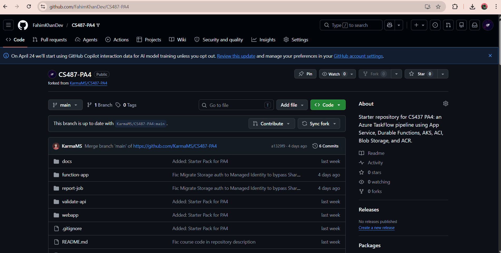

Description:This is my working GitHub repository (forked from KarmaMS/CS487-PA4): Starter repository for CS487 PA4, an Azure TaskFlow pipeline using App Service, Durable Functions, AKS, ACI, Blob Storage, and ACR.

### Evidence 1.2: App Service Overview

TODO: Embed screenshot of the Web App overview page showing `pa4-<rollnum>` and Running status.
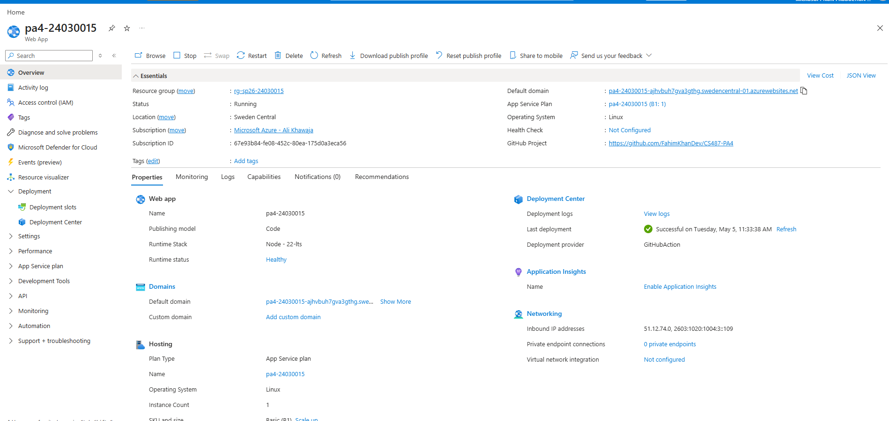

Description: `Resource group`: rg-sp26-24030015, `Region`: Sweden-Central, `Runtime`: Node - 22-LTS, and `Public URL`: https://pa4-24030015-ajhvbuh7gva3gthg.swedencentral-01.azurewebsites.net/

### Evidence 1.3: Deployment Center / GitHub Actions

TODO: Embed screenshot of Deployment Center or the successful GitHub Actions deployment.
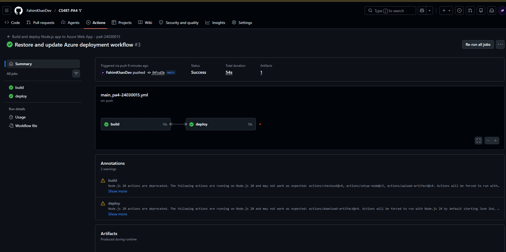
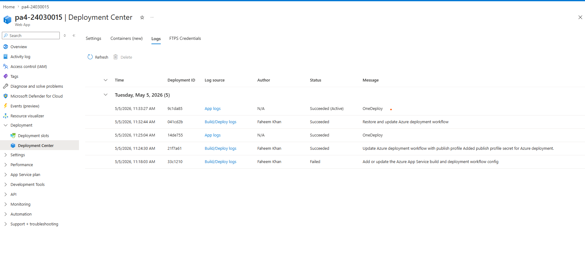

Description: TODO: Explain how the Web App is connected to your GitHub fork.  
`Answer`: I connected my GitHub fork to the Azure Web App by selecting GitHub as the source and GitHub Actions as the build provider. Azure automatically generated a workflow file in my fork's repository and also created a webhook on my GitHub fork. This webhook acts as a real time notifier,, every time I push new commits to my fork's main branch, GitHub sends a trigger event to Azure via the webhook. Azure then responds by invoking the GitHub Actions workflow, which builds the frontend code and deploys the latest version to the App Service.

### Evidence 1.4: Live Web UI

TODO: Embed screenshot of the TaskFlow page loaded in a browser.
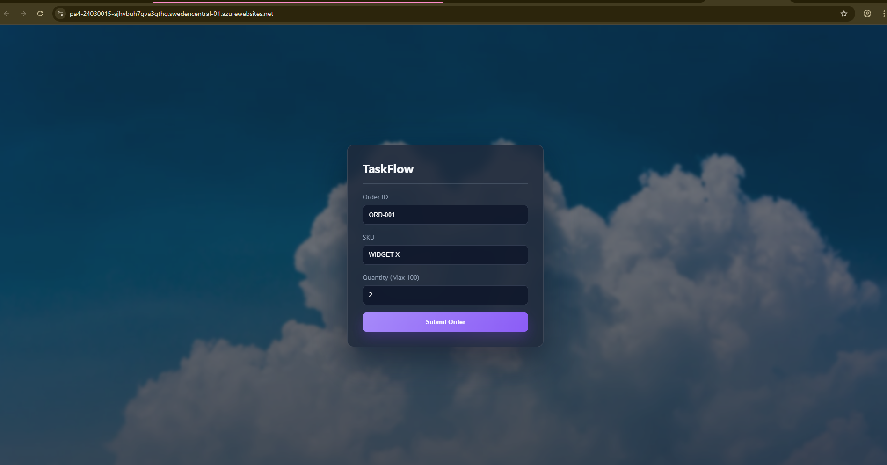

Description: TODO: Explain that the App Service is serving the frontend successfully.  
`Answer`: During deployment, GitHub Actions builds the frontend and uploads the static files to the Web App’s wwwroot directory. Azure App Service then serves these files over HTTP/HTTPS, automatically handling index.html as the entry point. The frontend loads correctly in the browser because the file paths, MIME types, and default document settings are properly configured by App Service.

---

## Task 2: Azure Container Registry (15 points)

### Evidence 2.1: ACR Overview

TODO: Embed screenshot of `crpa4<rollnum>` overview.
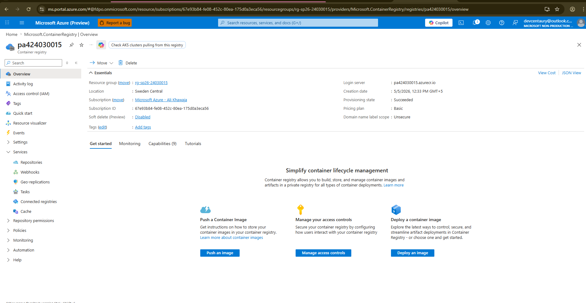

Description: TODO: `SKU`: Basic and `Resource group`: rg-sp26-24030015.

### Evidence 2.2: Docker Builds

TODO: Embed screenshot showing successful local builds for `validate-api`, `report-job`, and `func-app`.
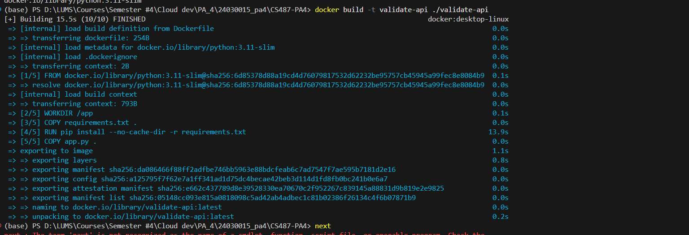
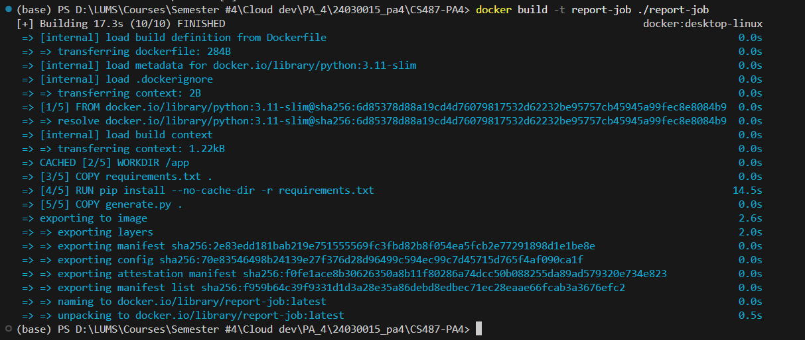
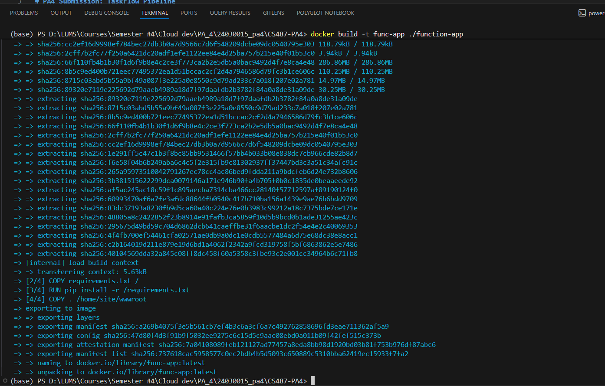

Description: TODO: Explain which folder produced each image.  
`Answer`: validate-api → from `validate-api/`, report-job → from `report-job/`, func-app → from `function-app/`  
The three Docker images were built locally:
- validate-api image was built from the validate-api/ folder (FastAPI service)
- report-job image was built from the report-job/ folder (one-shot PDF generator)
- func-app image was built from the function-app/ folder (Durable Functions container)

### Evidence 2.3: ACR Repositories

TODO: Embed screenshot or CLI output showing all three repositories in ACR.
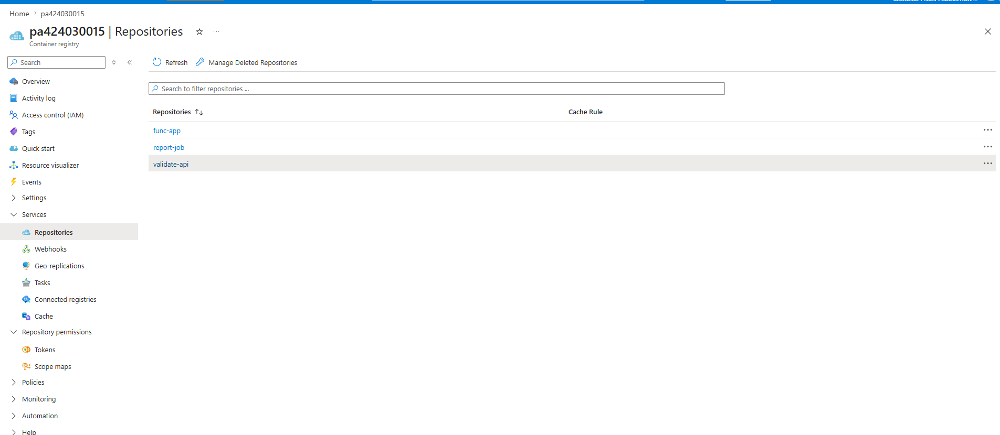
Description: Confirmed.

---

## Task 3: Durable Function Implementation (12 points)

### Evidence 3.1: Completed Function Code

TODO: Link to your completed file: [function_app.py](function-app/function_app.py).

Description: The Durable Function orchestrator implements a sequential workflow where an incoming order is first validated and then processed for report generation. The orchestrator receives the order input and calls the validate_activity, which sends the order to the validator service and returns a validation response. If the order is invalid, the orchestrator immediately returns a rejected status along with the reason. If the order is valid, the orchestrator proceeds to call report_activity, which creates a container instance to generate a report and stores it in Blob Storage. Finally, the orchestrator returns a completed status along with the generated report URL. This demonstrates how Durable Functions manage state and coordinate multiple asynchronous operations reliably.

### Evidence 3.2: Local Function Handler Listing

TODO: Embed screenshot of `func start` showing the HTTP starter, orchestrator, and activities.
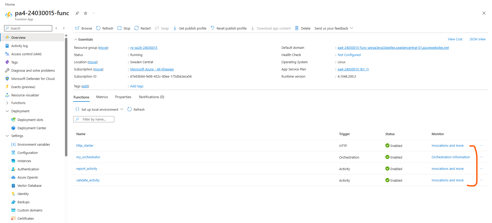
`NOTE`: I already deployed the function so the list is on portal, otherwise terminal was also showing locally  
`Description`: Durable Functions runtime successfully discovered and registered all required handlers, including the HTTP starter (http_starter), the orchestrator function (my_orchestrator), and both activity functions (validate_activity and report_activity). This confirms that the function app is correctly structured and that all components of the workflow are properly defined and ready to be triggered. The presence of these handlers ensures that the orchestration pipeline can execute end-to-end once deployed to Azure.

---

## Task 4: Function App Container Deployment (8 points)

### Evidence 4.1: Function App Container Configuration

TODO: Embed screenshot showing the Function App uses your `func-app:v1` image from ACR.
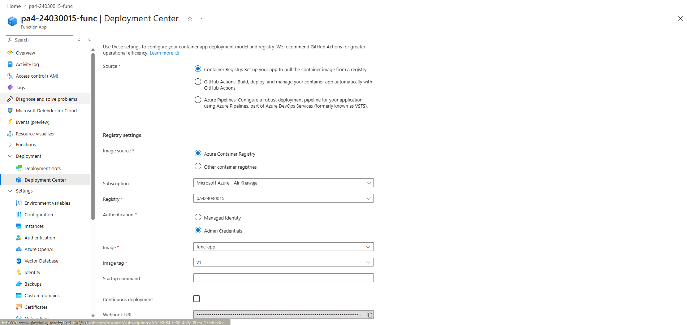
`Description`: The Function App `pa4-24030015` is configured to use the container image `pa424030015.azurecr.io/func-app:v1` from Azure Container Registry. This ensures the deployed function runs the custom Dockerized Durable Functions application.

### Evidence 4.2: Orchestration Smoke Test

TODO: Embed screenshot of the `curl` output that starts an orchestration and returns status URLs.
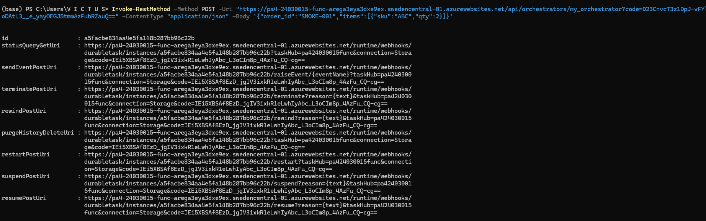
`Description`: The returned id represents the unique identifier of the orchestration instance created by the Durable Functions runtime. The statusQueryGetUri provides a dedicated endpoint to monitor the lifecycle of this orchestration. Together, they confirm that the HTTP starter successfully triggered the orchestrator and that the workflow is being managed asynchronously by Azure Durable Functions.

### Evidence 4.3: Expected Failed Status Before Downstream Wiring

TODO: Embed screenshot of the status query JSON showing the expected failure before `VALIDATE_URL` is configured.
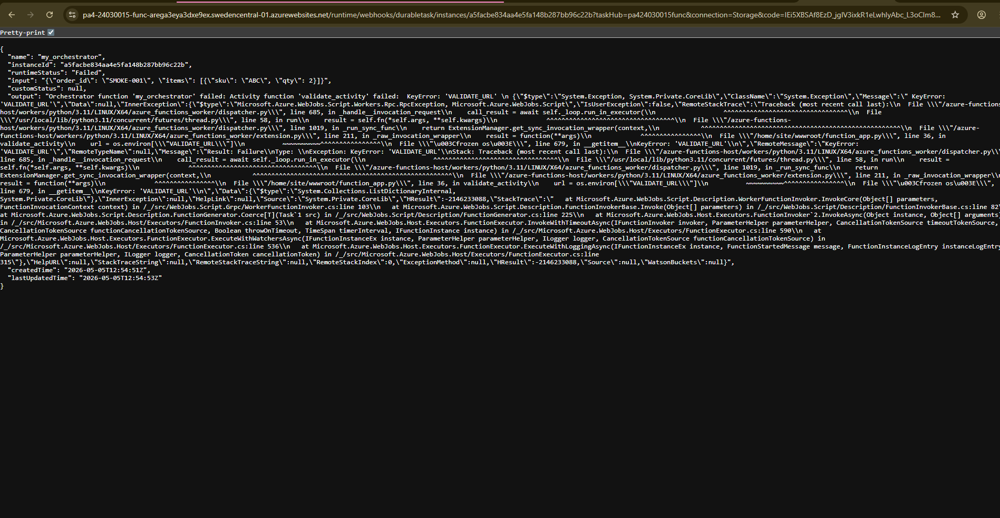
`Description`:The failure is expected at this stage because the downstream services required by the workflow are not yet fully configured. Specifically, the AKS-based validation service (VALIDATE_URL) has not been deployed or connected, so the validate_activity cannot complete successfully. This confirms that the function is executing correctly but fails due to incomplete infrastructure setup, which will be resolved in later tasks.

---

## Task 5: AKS Validator (15 points)

### Evidence 5.1: AKS Cluster

TODO: Embed screenshot of AKS overview showing `aks-24030015` succeeded.
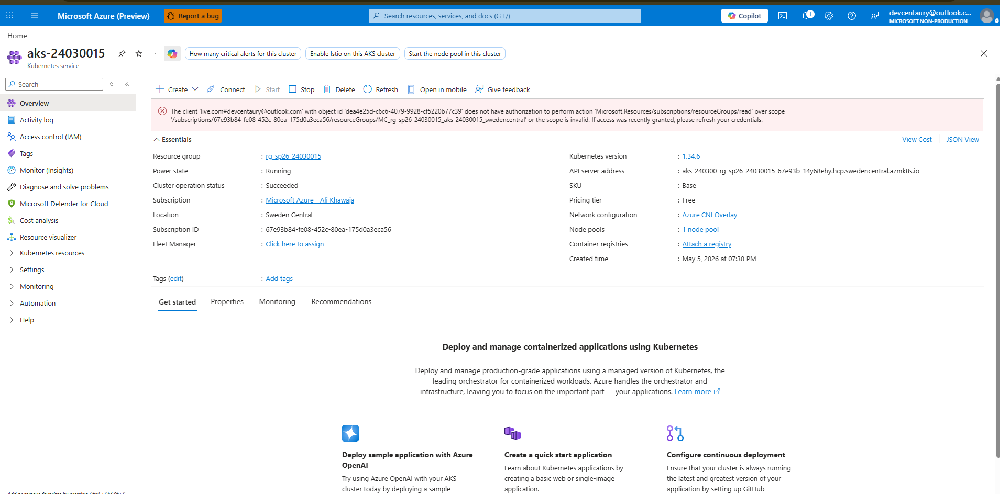

Description: State node count, node size: standard b2s, region: sweden central, and resource group: rg-sp26-24030015

### Evidence 5.2: Kubernetes Nodes and Pods

TODO: Embed screenshot of `kubectl get nodes` and `kubectl get pods`.
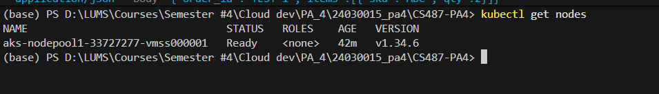
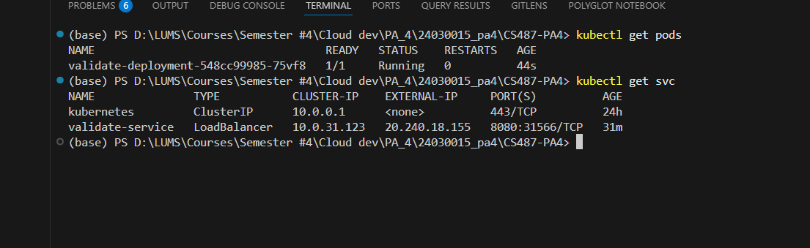

Description: TODO: Explain that the validator pod is scheduled and running.  
`Answer`: The validator pod is successfully scheduled on the AKS node and is in the Running state, confirming that the container is deployed and operational.

### Evidence 5.3: Kubernetes Service

TODO: Embed screenshot of `kubectl get service validate-service`.
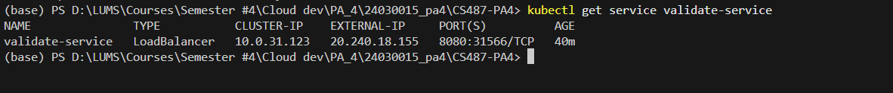

Description: `external IP`: 20.240.18.155 and `port exposed by the LoadBalancer`: 8080:31566

### Evidence 5.4: Validator API Tests

TODO: Embed screenshot of `curl /health`, a valid `curl /validate`, and an invalid `curl /validate`.
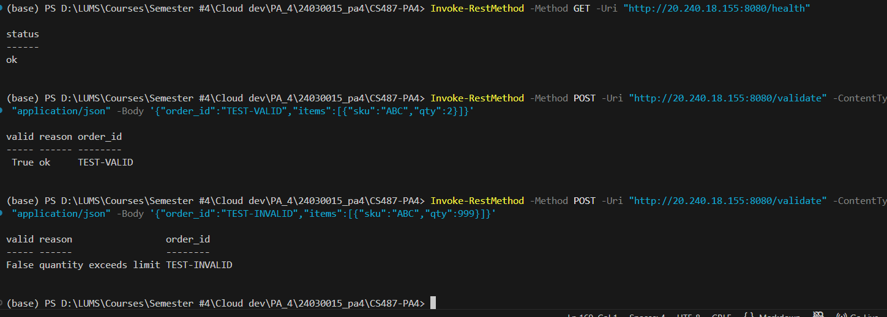

Description: TODO: Explain the accepted path and the `qty > 100` rejection rule.
`Answer`: The validator accepts requests where item quantity is within limits, and rejects requests where qty > 100, returning a validation failure response.

### Evidence 5.5: Function App `VALIDATE_URL`

TODO: Embed screenshot showing the Function App application setting `VALIDATE_URL`.
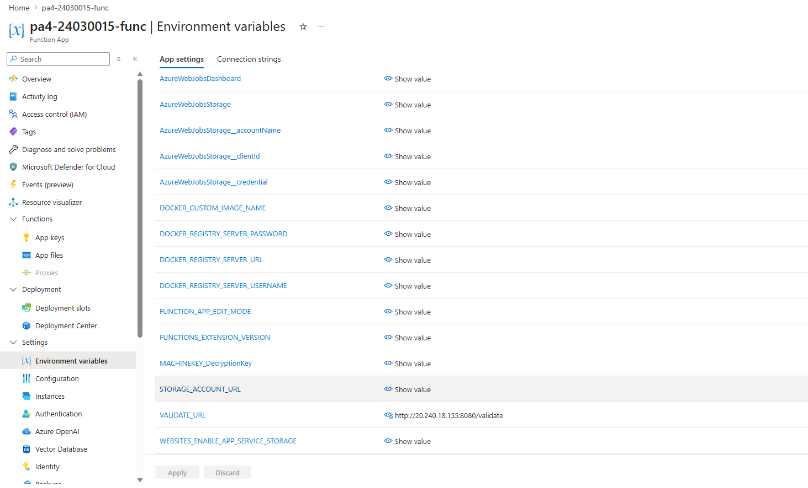

Description: TODO: Explain how the Durable Function reaches the AKS validator.
`Answer`: The Function App is configured with the VALIDATE_URL application setting, which points to the AKS-hosted validator service endpoint. This allows the Durable Function to call the external validation API during orchestration.

### Evidence 5.6: AKS Idle Behavior

TODO: Embed AKS metrics screenshot and/or `kubectl` output after the service is idle.

Description: TODO: Explain that the AKS node remains running even when there are no orders.
`Answer`:The AKS cluster remains active even when no requests are being processed. The node and validator pod continue running in the Ready/Running state, indicating that AKS does not automatically scale down to zero and continues to incur resources while idle.

---

## Task 6: ACI Report Job (15 points)

### Evidence 6.1: Blob Container

TODO: Embed screenshot of the `reports` blob container.
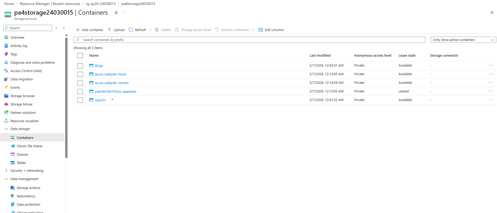

Description: TODO: Explain where generated PDFs are stored. 
`Answer`: The generated PDF reports are stored in the `reports` container within Azure Blob Storage. This container is used by the report job to persist output files generated by the Azure Container Instance.

### Evidence 6.2: Manual ACI Run

TODO: Embed screenshot of `az container show` for `ci-report-test`.
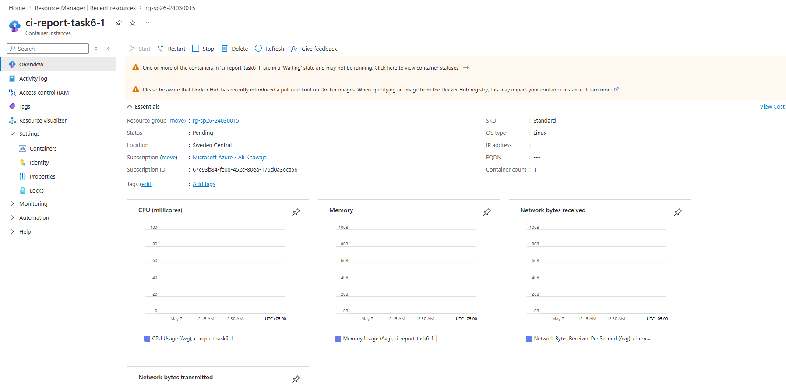
`NOTE`:  taken this ss right after running `please check lms for command` command that basically runs the function app which created this ci-report  Description: TODO: State the final container state and why the job exits.  
`Answer`: The container instance completes with a Succeeded state after executing the report job. This is expected because the container performs a one-time task (generate and upload the report) and then exits instead of running continuously.

### Evidence 6.3: ACI Logs

TODO: Embed screenshot of `az container logs`.
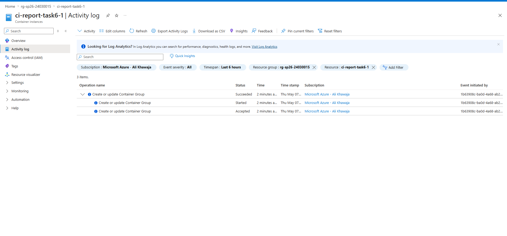

Description: TODO: Explain what the report job printed after generating and uploading the PDF.  
`Answer`:The ACI logs show that the report job successfully processed the input order, generated the PDF, and uploaded it to Azure Blob Storage. The logs confirm the execution flow and successful completion of the reporting task. it gets deleted afterwards too.

### Evidence 6.4: Generated PDF

TODO: Embed screenshot showing `TEST-001.pdf` in Blob Storage or opened from Blob Storage.
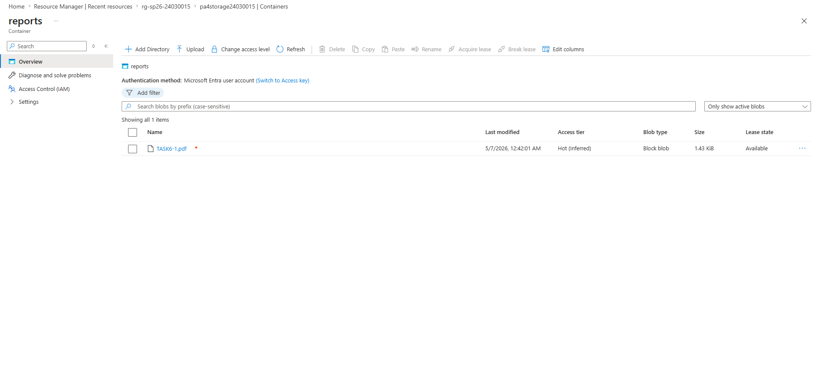

Description: TODO: Explain how this proves the ACI wrote to storage.  
`Answer`:The presence of the generated PDF (e.g., TEST-001.pdf) in the Blob Storage container confirms that the Azure Container Instance successfully wrote the output file to storage, validating end-to-end integration between ACI and Blob Storage.

### Evidence 6.5: Function App Managed Identity and IAM

TODO: Embed screenshots of system-assigned identity enabled and Contributor role assignment on your resource group.
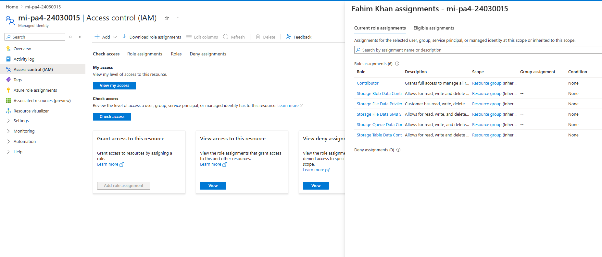
Description: TODO: Explain why the Function App needs this permission to create ACIs.
 `Answer`:The Function App uses a managed identity with Contributor access on the resource group to dynamically create and manage Azure Container Instances. This permission is required to allow the function to provision container groups programmatically during report generation.

### Evidence 6.6: Report App Settings

TODO: Embed screenshot of `REPORT_*`, `ACR_*`, `STORAGE_CONN`, and `SUBSCRIPTION_ID` settings.
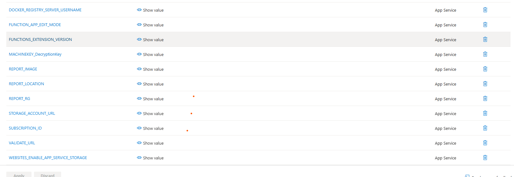
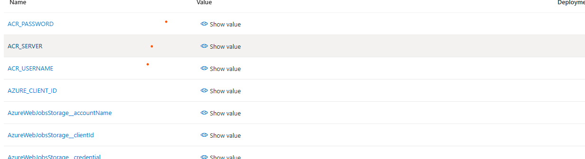

Description: TODO: Explain what each group of settings is used for. Mask secrets.The REPORT_* settings define the container image and resource configuration for the report job. The ACR_* settings provide authentication details for pulling the container image from Azure Container Registry. The STORAGE_CONN (or equivalent storage settings) is used by the container to upload generated reports to Blob Storage. The SUBSCRIPTION_ID is required to allow the Function App to interact with Azure resources such as Container Instances within the correct subscription.

---

## Task 7: End-to-End Pipeline (15 points)

### Evidence 7.1: Web App Wiring

TODO: Embed screenshot showing `FUNCTION_START_URL` and `FUNCTION_STATUS_URL` configured on the Web App.
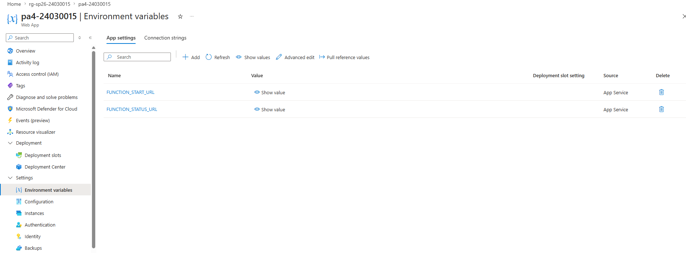

Description: TODO: Explain how the frontend starts and polls the Durable orchestration.
`Answer`:The frontend Web App uses the FUNCTION_START_URL to initiate the Durable Function orchestration and receives a statusQueryGetUri in response. It then uses FUNCTION_STATUS_URL to continuously poll the orchestration status until completion, enabling real-time updates of the request state.

### Evidence 7.2: Happy Path UI

TODO: Embed screenshots of the form before submit, Running status, and Completed status with report URL.
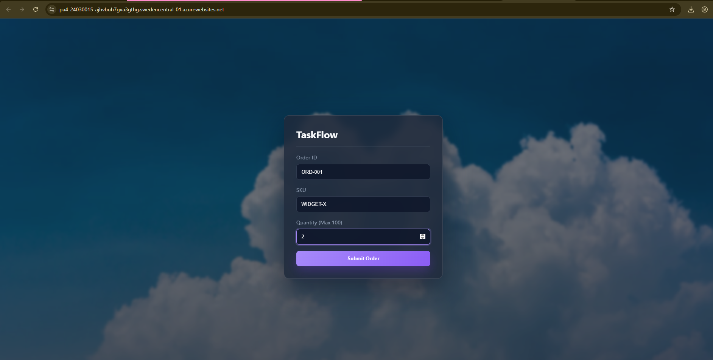
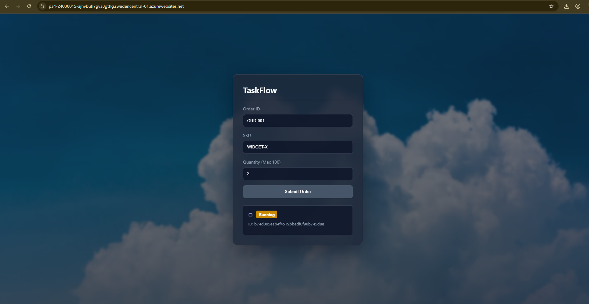
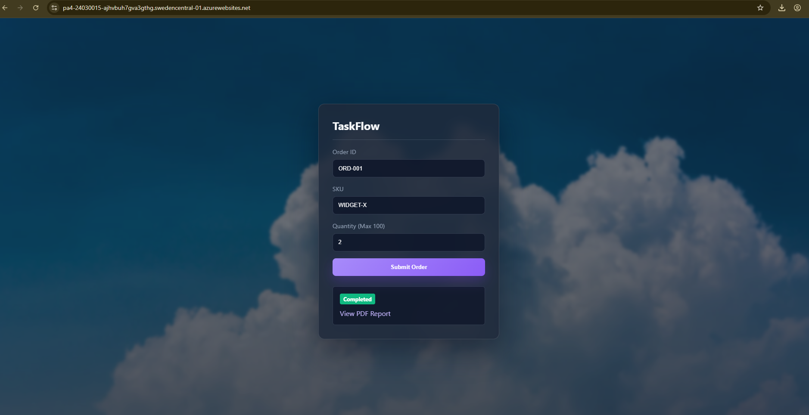

Description: TODO: Explain the valid order payload and final result. 
`Answer`:A valid order with a quantity within acceptable limits (e.g., qty = 2) is submitted through the UI. The system transitions from an initial Running state to Completed, and a report URL is returned. This demonstrates successful validation, processing, and report generation.

### Evidence 7.3: Backend Participation

TODO: Embed screenshots showing Function App invocation, AKS validator evidence, ACI evidence, and Blob PDF evidence.
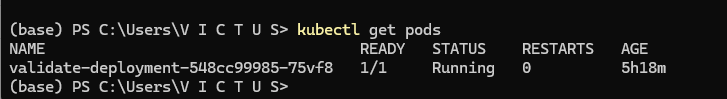
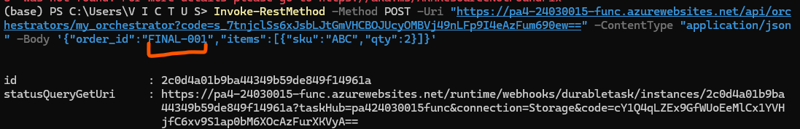
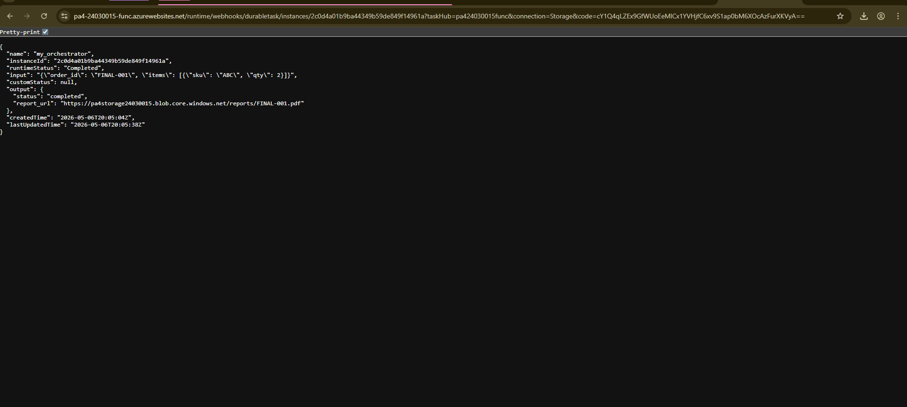

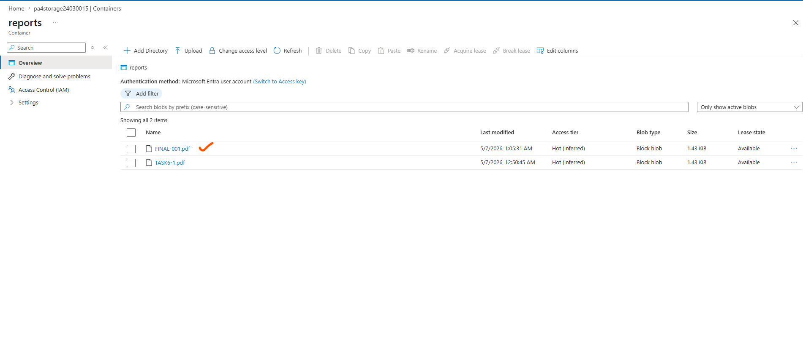
Description: TODO: Trace the same order ID across services.
 `Answer`:The order ID FINAL-001 can be traced across all backend services. The Function App initiates the orchestration, the AKS-hosted validator processes the request, an Azure Container Instance is created to generate the report, and the final PDF is stored in Blob Storage. This demonstrates complete end-to-end backend integration.

### Evidence 7.4: Reject Path UI

TODO: Embed screenshot of an order with `qty > 100` being rejected.

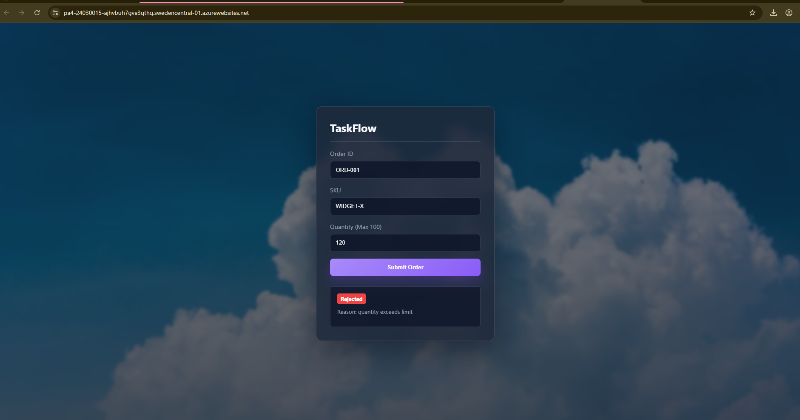

Description: TODO: Explain why no report ACI should be created for this order. 
`Answer`:Orders with quantity greater than 100 are rejected by the validation service. The orchestration terminates at the validation stage and does not proceed to report generation, ensuring that no Azure Container Instance is created for invalid requests.

---

## Task 8: Write-up and Architecture Diagram (5 points)

### Evidence 8.1: Architecture Diagram

TODO: Embed your architecture diagram from `docs/`.
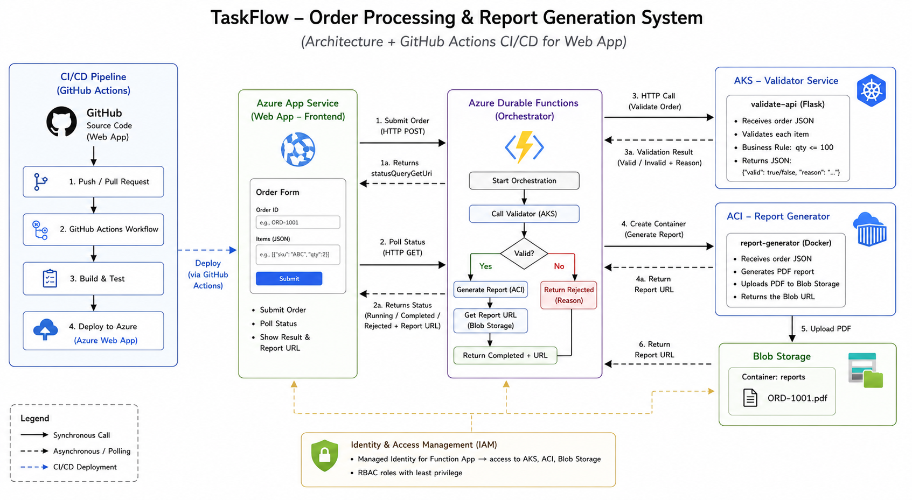

Description: TODO: Confirm that it shows GitHub, App Service, Durable Function, AKS, ACI, Blob Storage, ACR, and IAM.

### Question 8.2: Service Selection

TODO: In 3-4 sentences each, explain why TaskFlow uses App Service, Durable Functions, AKS, and ACI for their specific roles.  
`Answer`:App Service is used to host the frontend Web App because it provides a simple, fully managed platform for deploying web applications with built-in scaling and configuration support. It integrates easily with environment variables and supports continuous deployment from GitHub, making it ideal for UI hosting.Durable Functions are used to orchestrate the workflow because the process involves multiple steps including validation, conditional branching, and report generation. It provides stateful execution and built-in orchestration patterns, which simplifies managing long-running workflows and tracking execution status. AKS is used for the validator service because it represents a continuously running backend microservice that can handle multiple requests and scale independently. It is suitable for workloads that need persistent availability and control over containerized services.

### Question 8.3: ACI vs AKS

TODO: Compare idle behavior, cost behavior, and operational model for AKS and ACI using your screenshots.
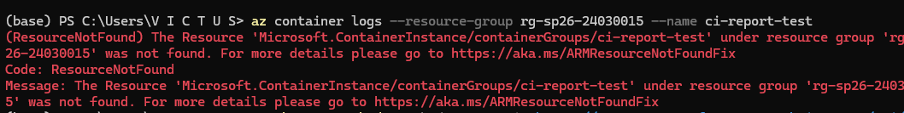  

`NOTE`:AKS remains running even when idle, as shown by the node and pods staying in the Running/Ready state, which leads to continuous resource consumption and cost. In contrast, ACI only runs when triggered and stops after completing the job, resulting in no idle cost. Operationally, AKS requires cluster management and deployment configuration, while ACI is serverless and requires minimal setup for running containerized jobs.

### Question 8.4: Durable Functions vs Plain HTTP

TODO: Explain at least two problems that Durable Functions solves for this sequential workflow. 
`Answer`:Durable Functions solve the problem of managing long-running workflows by maintaining state between steps, which is difficult with plain HTTP calls. They also enable built-in retry mechanisms and orchestration logic, allowing conditional execution (such as stopping the workflow on validation failure) without manually handling state tracking and coordination.

### Question 8.5: Cost Review

TODO: Embed Cost Management screenshot scoped to your resource group.
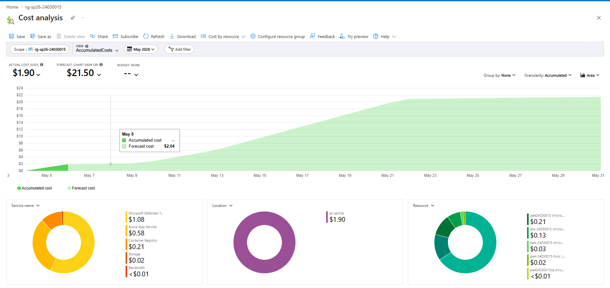

Description: TODO: Identify the most expensive resource and explain why. `answer`: The most expensive resource in the system is AKS because it runs continuously even when idle, consuming compute resources for the node. Unlike ACI or Functions, which are event-driven and scale to zero, AKS maintains active infrastructure, leading to higher baseline costs.

### Question 8.6: Challenges Faced

TODO: Describe at least two real issues you hit and how you debugged them.
`Answer`:One issue encountered was Azure Blob Storage authorization errors when using managed identity. This was debugged by verifying environment variables, checking role assignments, and ensuring correct storage account configuration. Another issue was the Function App not loading functions due to incorrect container deployment, which was resolved by properly configuring the container image in Deployment Center and setting the required environment variables.
---
